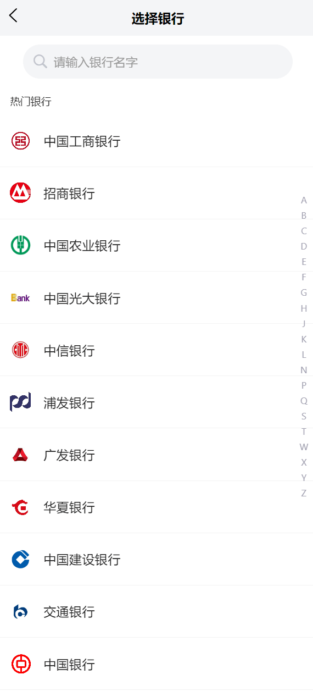
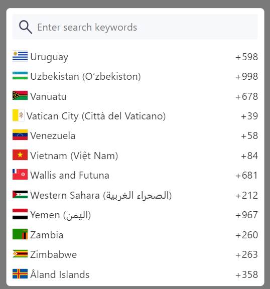

uniapp 快捷基础项目框架 下载下来就可以用
包括pinia http manifest uni_modules pages.json 和一些基础配置  
包括 扫码 通讯录页面 国家地区选择  
不需要的可以删掉  

# uni-nav-bar 使用示例
```html
<uni-nav-bar :border="false" title="登录" :fixed="true" :statusBar="true" class="need-edit">
  <block v-slot:left>
    <text class="bar-right-text">left</text>
  </block>
  <view class="center">
    <view>1111</view>
  </view>
  <block v-slot:right>
    <text class="bar-right-text">right</text>
  </block>
</uni-nav-bar>
```


# z-paging 使用示例
```html
// 初始化分页组件引用
let zpaging = ref(null)
// 初始化加载状态
let loading = ref(true)
let paramsNos = ref({
  page_size: 10,
})
async function getBetOrderRecords(pageNum, pageSize) {
  let paramsNo = {
      pageNum: pageNum,
    pageSize: pageSize,
    ...paramsNos.value
  }
  let { data, code } = await getBetOrderRecord(paramsNo)
  if (data && code === 1000) {
    zpaging.value.complete(data.list)
    // zpaging.value.complete([1, 2, 3, 4, 5, 6, 7])
  } else {
    zpaging.value.complete(false)
  }
}

<z-paging ref="zpaging" :fixed="false"  use-inner-list @query="getData" :default-page-size="5" cell-height-mode="dynamic" :safe-area-inset-bottom="true" :auto-show-back-to-top="true" :preload-page="30" :inside-more="true" :auto-show-system-loading="true" :auto-hide-loading-after-first-loaded="false" :system-loading-text="''">
    <template #top>

    </template>
    <template #cell="{item,index}">
       <image src="/static/images/shuaxin.png" mode="widthFix" class="spin-loading" v-if="loading" />


    </template>
</z-paging>
```


# mescroll-body 使用示例 未导入到项目中
```html
let lists = ref(null)
getMescroll().resetUpScroll()
async function getData(mescroll) {
  let paramsNo = {
    ...params.value,
    pageNum: mescroll.num,
    pageSize: mescroll.size,
  }
  let { data, code } = await getData1(paramsNo)

  if (data && code === 1000) {
    if(mescroll.num == 1) lists.value = []
    lists.value = lists.value.concat(data.list)
    mescroll.endSuccess(listTemp.length)
  } else {
    mescroll.endErr()
  }
}

import { onPageScroll, onReachBottom } from '@dcloudio/uni-app';
import useMescroll from "/uni_modules/mescroll-uni_1.3.8/hooks/useMescroll.js";
const { mescrollInit, downCallback, getMescroll } = useMescroll(onPageScroll, onReachBottom)

<mescroll-body @init="mescrollInit" @down="downCallback" @up="getData" :up="{page:{num : 0 ,size : 5} }">
    </mescroll-body>
```

 # 通讯录  是一个页面 vue2
```html
在/pages/other/banList.vue
```



# 国家选择 是一个组件 vue2
```html
在/components/region-select

使用的地方
<region-select @getSelectCode="getSelectCode()" v-show="regionSelectShow"></region-select>
let regionSelectShow = ref(false)
function getSelectCode(data) {
  regionSelectShow.value = false
  if(data) {
    console.log(data)
  }
}
```

